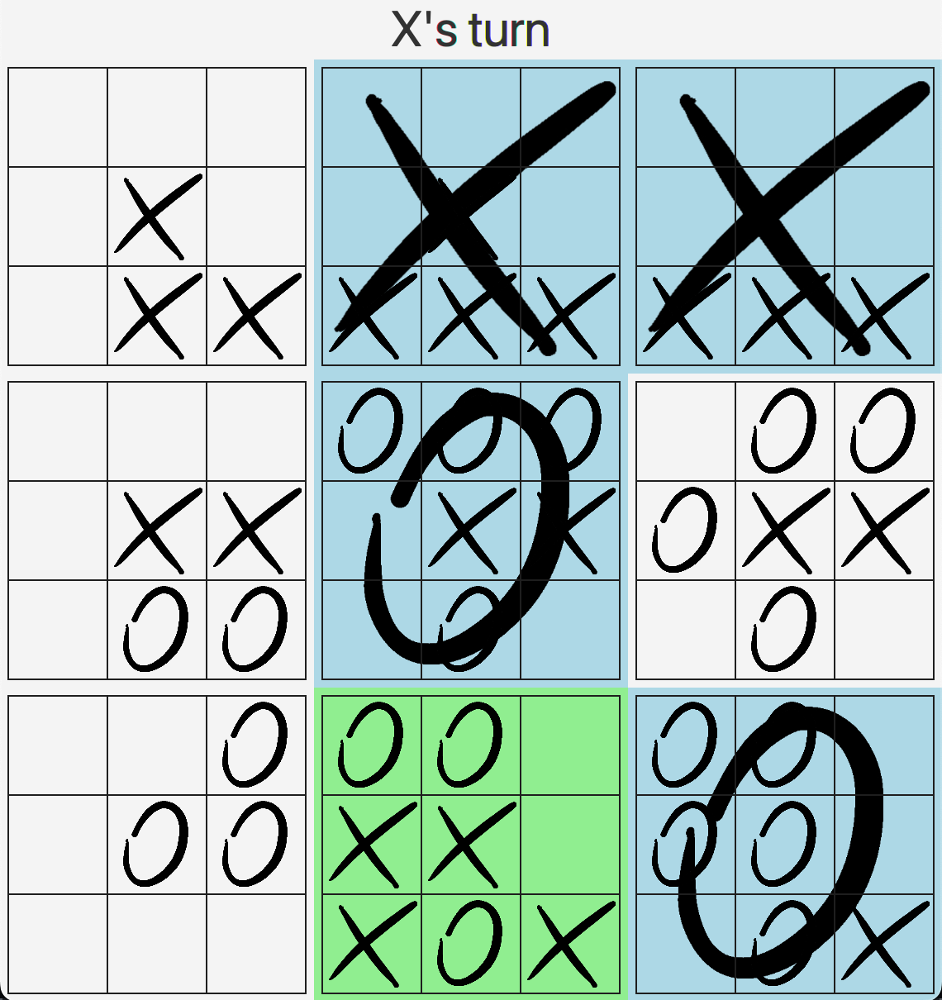
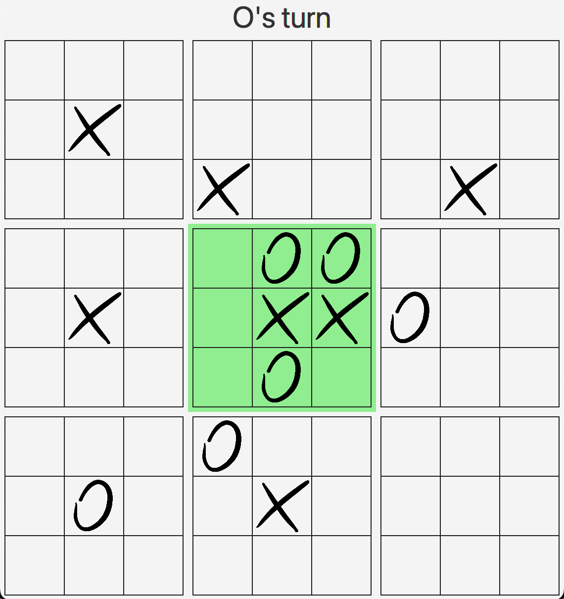
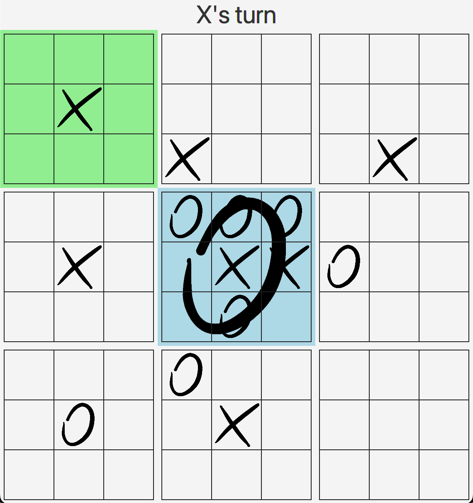
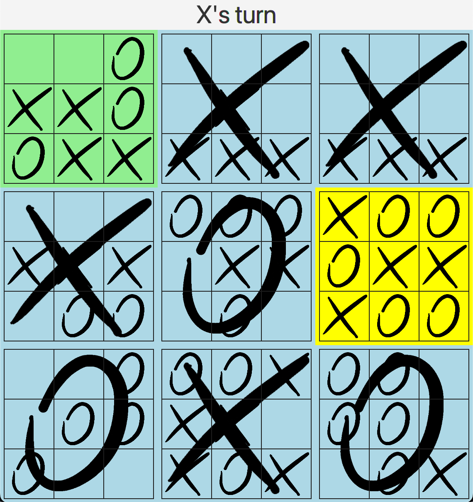
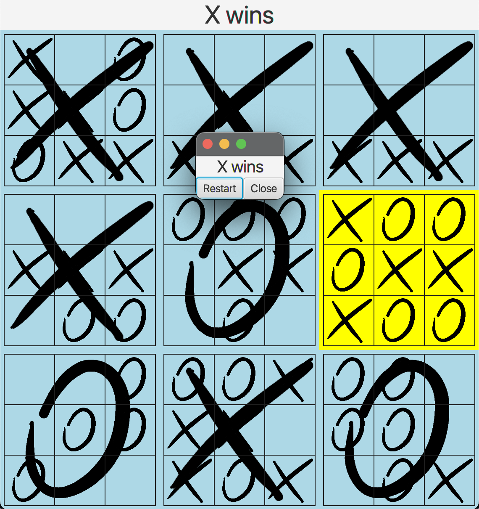

# Ultimate Tic-tac-toe

Inspired by https://ultimate-t3.herokuapp.com

The game is a strategic development of the classic tic-tac-toe.

<p align="center">
  
</p>

Now the board consists of 9 smaller tic-tac-toe boards.

The idea is simple - placing X or O on e.g. upper left field 
on a current small board limits the next move of the rival 
player to the upper left small board.

<p align="center">
  
  
</p>

The goal is to win on three smallboards in a row.

<p align="center">
  
  
</p>

Currently playable smallboards are highlighted in green,
in yellow tied smallboards and in blue smallboards with no
possible moves left.

The game is designed for two players (X and O).

## Requirements

* Java 16

## How to play

On Unix based OS run
```
./gradlew run
```

On Windows run
```
gradlew run
```


